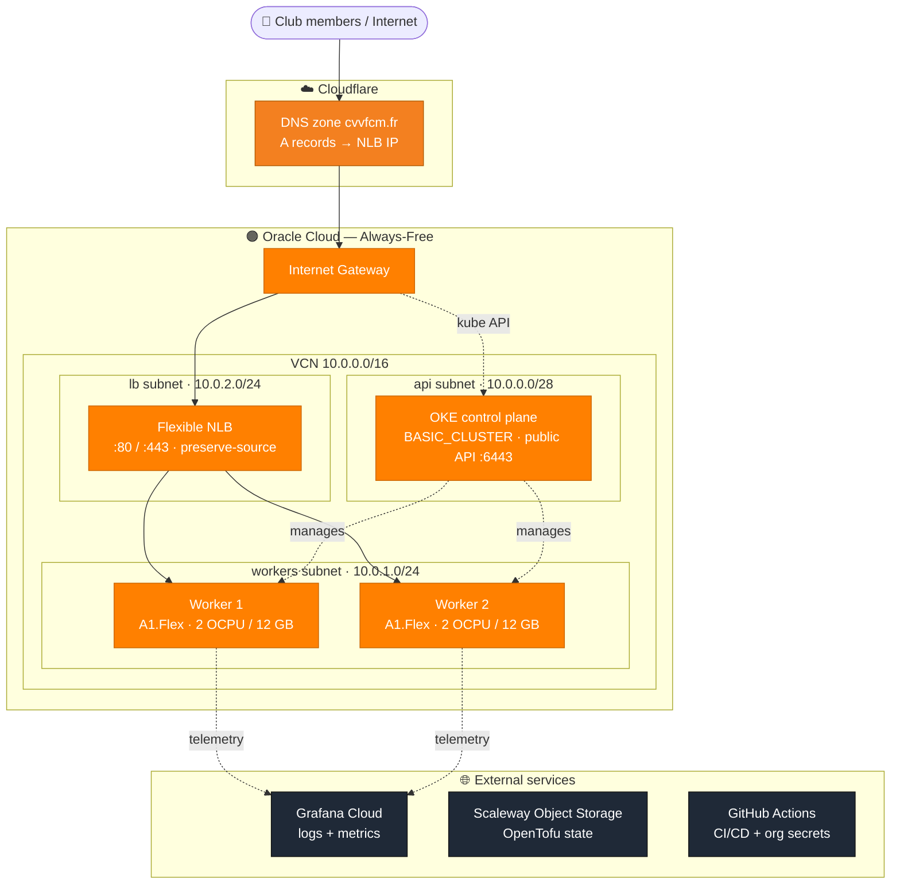
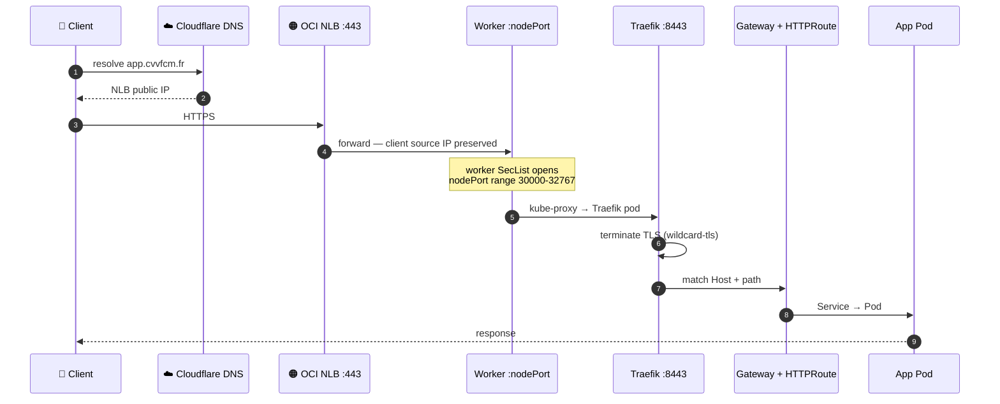
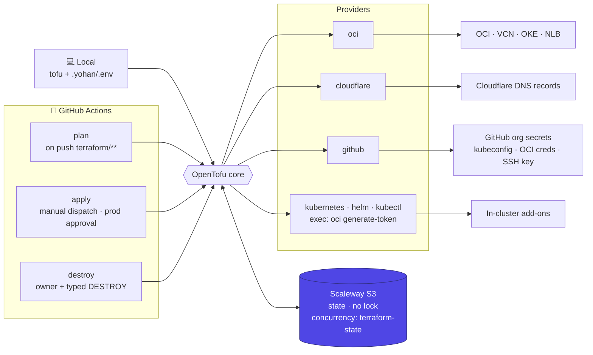
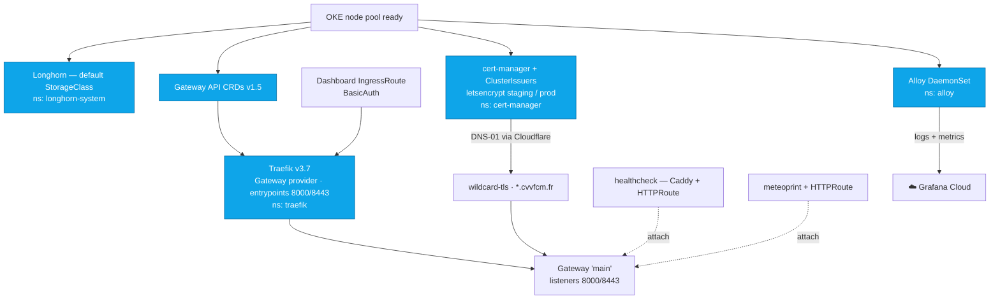

# CVVFCM Kubernetes Cluster

Infrastructure-as-code for the **CVVFCM** sailing club's Kubernetes cluster,
running on **Oracle Cloud (OKE) Always-Free tier** and provisioned end-to-end
with **OpenTofu** — cluster, network, ingress, storage, TLS, DNS and telemetry.

This README is the architectural map. For commands, conventions and operational
detail (how to plan/apply, the two-phase bootstrap, free-tier limits), see
[`AGENTS.md`](./AGENTS.md).

## Architecture

### 1. Infrastructure & network topology

Where everything lives: public subnets inside one VCN — control plane, a flexible
NLB, and two ARM workers — fronted by Cloudflare DNS and backed by external SaaS.

### 2. Request lifecycle

How an HTTPS request reaches a pod — including the two non-obvious hops: the NLB
preserves the client source IP onto a worker NodePort, and the Gateway listeners
bind Traefik's entrypoints `8000/8443` (not `80/443`).

### 3. Provisioning & CI/CD

OpenTofu drives four provider groups; state lives in Scaleway Object Storage (no
locking, so runs are serialized via a concurrency group). The first apply is
two-phase: target the cluster + node pool, then the kubernetes/helm/kubectl
providers can authenticate against the live API. `apply` and `destroy` are gated.

### 4. In-cluster platform & observability

Add-on dependency order (node pool → storage / Gateway CRDs / cert-manager →
Traefik → Gateway → app routes), wildcard TLS issued via Let's Encrypt DNS-01,
and the telemetry hop to Grafana Cloud.

## Components

| Component | Namespace | Role |
|---|---|---|
| OKE cluster | — | Managed Kubernetes control plane (`BASIC_CLUSTER`, free) |
| Worker pool | — | 2× `VM.Standard.A1.Flex` ARM nodes (2 OCPU / 12 GB each) |
| Longhorn | `longhorn-system` | Default StorageClass, replicated across node boot disks |
| Gateway API CRDs | — | Standard channel v1.5 (matched to Traefik v3.7) |
| Traefik | `traefik` | Ingress via Gateway API, TLS termination, dashboard |
| cert-manager | `cert-manager` | Let's Encrypt DNS-01 wildcard cert (`*.cvvfcm.fr`) |
| Grafana Alloy | `alloy` | Logs + metrics collector → Grafana Cloud |
| healthcheck | `healthcheck` | Caddy probe app proving the ingress path |
| meteoprint | `meteoprint` | Application |

External: **Cloudflare** (DNS), **Scaleway Object Storage** (OpenTofu state),
**GitHub Actions** (CI/CD + org-secret export), **Grafana Cloud** (observability).

---

See [`AGENTS.md`](./AGENTS.md) for build/apply commands, the two-phase bootstrap,
free-tier budget limits, and platform conventions.
